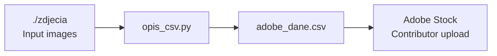

# adobe-stock-mass-uploader

<p align="left">
  
  
  
  
</p>

An AI-assisted metadata pipeline that transforms raw image batches into **Adobe Stock-ready CSV uploads**.  
The project turns a repetitive, manual content-ops workflow into a deterministic, validation-driven, production-style automation pipeline.

---

## Project Overview

Uploading stock assets at scale is rarely blocked by image generation or editing itself — the real bottleneck is metadata:  
**titles, keyword sets, category mapping, formatting, consistency, and upload readiness**.

This project solves that bottleneck by taking a folder of source images, processing them in **fixed-size multimodal batches**, sending them to **Gemini**, and producing a clean `adobe_dane.csv` file that can be imported directly into Adobe Stock.

### Pipeline

- scans a local input directory for supported image files,
- groups files into **exact batches of 20 images**,
- resizes images in memory to reduce vision-token cost,
- calls Gemini with a strict JSON contract,
- validates and repairs malformed model outputs,
- normalizes Adobe Stock category values,
- sanitizes titles and keyword lists,
- appends final rows into a CSV with the exact schema needed for downstream upload.

This repo is intentionally small, but it demonstrates:

- strong I/O contracts,
- defensive parsing,
- deterministic processing,
- cost-aware LLM usage,
- retry/backoff handling,
- and clean separation between ingestion, inference, validation, and export.

---


### Why it may be technically interesting?

Because LLM integrations become impressive only when they are **operationally reliable**.

- deterministic batch processing
- schema-aware validation
- fault-tolerant JSON recovery
- repair loops for broken model output
- normalization of loosely formatted category data
- cost optimization via image downscaling
- retry logic for quota/transient failures
- CSV contract enforcement for downstream tooling compatibility


---

## Architecture & Pipeline Flow



##  Processing Workflow

**1. Input**
* Load files from the base directory: `Input Folder (./zdjecia)`

**2. Image Discovery & Stable File Ordering**
* Discover images and sort them in a stable, reproducible order.

**3. Exact Batch Chunking**
* Divide images into precise working batches (exactly **20 images per batch**).

**4. In-memory Image Preprocessing**
* Process images in RAM.
* Resize, convert to RGB profile, and optimize to lower token cost.

**5. Gemini Multimodal Request**
* Send request: `Prompt + 20 images`.
* Enforce a strict **JSON-only** response contract.

**6. JSON Parsing & Recovery**
* Parse the response (strip Markdown fences / salvage the first valid JSON array).

**7. Validation Layer**
* Enforce strict structural rules:
  * Exactly 20 objects.
  * Indexes ranging from `0..19`.
  * Title presence and sanitization.
  * Between `45` and `49` keywords.
  * Category normalization to Adobe Stock IDs.

**8. Optional Repair Pass** *(Conditional)*
* If the JSON structure is malformed, trigger a text-only correction prompt to fix errors.

**9. Post-processing**
* Data cleaning and final refinement:
  * Deduplicate keywords.
  * Remove banned phrases and digits.
  * Safely pad missing keywords if needed.
  * Final normalization of category names and IDs.

**10. CSV Writer**
* Generate rows with fields: `Filename`, `Title`, `Keywords`, `Category`, `Releases`.

**11. Output**
* Save the final data to the output file: `adobe_dane.csv`

### Design notes

- The pipeline uses **stable ordering** so each returned object can be mapped back to the correct filename.
- It is intentionally **batch-driven** rather than event-driven because the downstream task is throughput-oriented and constrained by model request economics.
- The validation/repair step is a pragmatic pattern for making LLM output usable in automation pipelines.

---

## Tech Stack & Tools

### Language

- **Python 3.11+**
  - Chosen for rapid iteration, mature file/data tooling, and great support for scripting AI workflows.

### AI / Model Integration

- **Google Gemini (`google-generativeai`)**
  - Used for multimodal understanding of image batches and structured metadata generation.
  - Good fit for rapid prototyping of image-to-structured-data pipelines.

### Image Processing

- **Pillow**
  - Used to load, normalize, and downscale images in memory before inference.
  - A deliberate engineering choice to reduce request cost and payload size without mutating source assets on disk.

### Configuration / Runtime

- **python-dotenv**
  - Keeps secrets out of source code and simplifies local developer setup.

### Standard Library

- **argparse** — CLI configurability  
- **csv** — output generation compatible with import workflows  
- **json** — structured response parsing and repair  
- **logging** — operational visibility  
- **pathlib** — filesystem ergonomics  
- **re / unicodedata** — normalization, cleanup, category matching  

---

## Local Setup & Installation

### Prerequisites

- Python **3.11+**
- A **Google Gemini API key**
- A folder containing input images in one of the supported formats:
  - `.png`
  - `.jpg`
  - `.jpeg`
  - `.webp`

### 1. Clone the repository

```bash
git clone https://github.com/SatukerRekiner/adobe_stock_mass_uploader.git
cd adobe_stock_mass_uploader
```

### 2. Create and activate a virtual environment

#### macOS / Linux

```bash
python -m venv .venv
source .venv/bin/activate
```

#### Windows (PowerShell)

```powershell
python -m venv .venv
.venv\Scripts\Activate.ps1
```

### 3. Install dependencies

```bash
pip install google-generativeai pillow python-dotenv
```

### 4. Configure environment variables

Create a `.env` file in the project root:

```env
GOOGLE_API_KEY=your_gemini_api_key_here
```

> The script can also read `GEMINI_API_KEY`, but `GOOGLE_API_KEY` is the primary option.

### 5. Add your images

Put your source images into the default input folder:

```bash
mkdir -p zdjecia
```


### 6. Run the pipeline

```bash
python opis_csv.py
```

### 7. Run with explicit options

```bash
python opis_csv.py \
  --input-dir ./zdjecia \
  --output-csv ./adobe_dane.csv \
  --model gemini-2.5-flash \
  --batch-size 20 \
  --temperature 0.2 \
  --vision-max-side 256 \
  --max-completion-tokens 0
```

---

## Example Inputs & Outputs

| Input | Title | Keywords | Category | Releases |
|---|---|---|---:|---|
|  | Professional Trader Pointing at Stock Market Charts on Dual Monitors in Home Office | professional trader, stock market, market analysis, dual monitors, home office, investment, finance, business, technology, data visualization, charts, graphs, cryptocurrency, forex, stock trading, entrepreneur, professional, concentration, focus, strategy, economy, global finance, digital tools, software, application, wealth management, financial planning, risk management, trading platform, digital composition, photorealistic, mature man, executive, manager, corporate, remote work, modern workspace, financial technology, fintech, economic trends, data driven, investment strategy, digital assets, portfolio management, financial success, financial expert | 3 |  |
|  | Energetic Woman Engaging in Virtual Conference Call from Stylish City Apartment | video conference, video call, online meeting, virtual meeting, telecommuting, teleconference, business, communication, technology, laptop, computer, woman, female, adult, city, skyline, sunset, modern apartment, luxury, lifestyle, remote work, work from home, presentation, webinar, entrepreneur, professional, corporate, global, connectivity, internet, cloud, remote team, collaboration, digital, success, urban, executive, leadership, sales, marketing, finance, remote office, smart home, elegant, sophisticated, digital composition, render, animated, expressive | 3 |  |
|  | Young Man Commuting on a Train, Browsing Files on His Smartphone with Headphones On | commute, commuting, train, subway, public transport, urban, city, travel, journey, passenger, man, male, young, smartphone, mobile phone, digital, technology, headphones, music, audio, entertainment, browsing, files, documents, cloud storage, connectivity, internet, modern, lifestyle, daily routine, busy, on the go, remote work, business, leisure, relaxation, focus, concentration, window, city view, transportation, communication, digital nomad, productivity, his | 20 |  |
